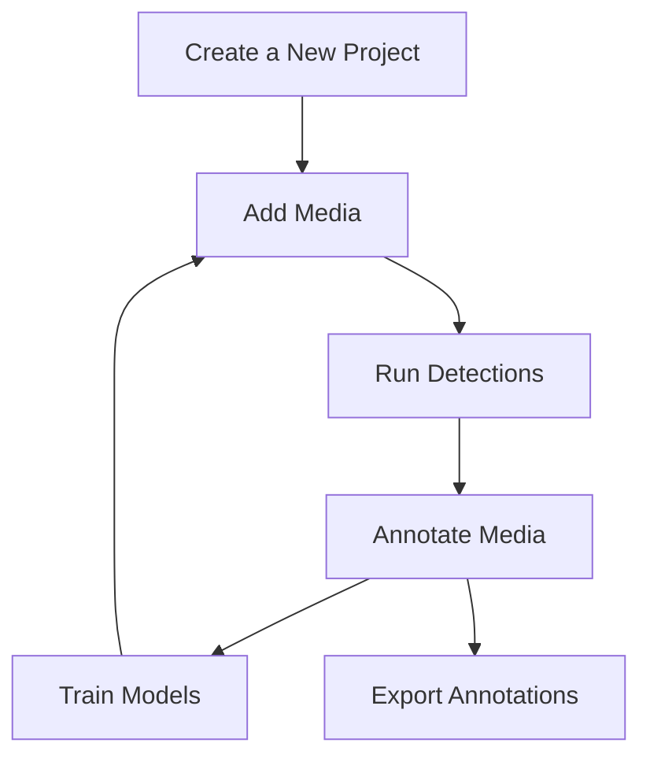

# Creating Your First Project

A project serves as a container for managing a collection of images, annotations, and models. It provides a structured environment to streamline the process of detection, annotation, and model training.

## Configuring Your Project

Configuring a project involves defining the following settings. You will be prompted to do so on creation of new projects.

| Setting                              | Description                                                                 |
|--------------------------------------|-----------------------------------------------------------------------------|
| **Load model**                       | Select what model will be used for detections.                              |
| **Specify detections**               | Select which objects the model should write detections for.                 |
| **Model confidence**                 | How certain the model should be in the object in order to write the detection. |
| **Select video slice interval**      | In the case of videos, how far apart should the frames be captured?          |
| **Automatically filter dead video**  | Select whether the video should save frames that do not include a written detection. |

!!! info
    These settings may be changed at any time after initial configuration by navigating to the "settings" tab while in a project.

!!! tip
    Remember to press "Apply" when you are done!

## Adding media

After configuration, you can begin to add media. Currently, we support the following formats:

- `.MP4`
- `.MOV`
- `.PNG`
- `.JPG`

!!! info
    Media will be screened on upload, before being loaded into the project. Detection may be re-run on a per-frame basis with a custom confidence via the **"detect"** button, in the event that experimenting with confidence is desired.
!!! warning
    Running **"detect"** on a single frame will overwrite existing detections.

## Annotating media

## Model Training